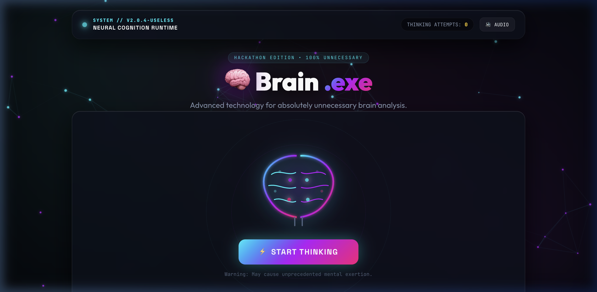
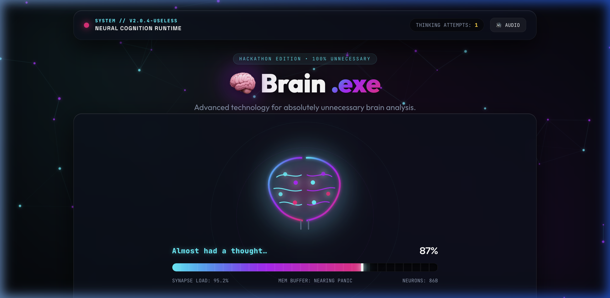
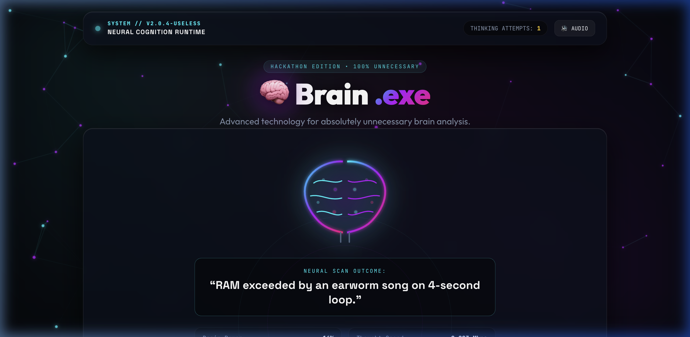

# HUMAN SIMULATOR


## Basic Details
### Team Name: SAVS


### Team Members
- Team Lead: Aavanni Subash - SNMIMT Maliankara
- Member 2: Sivapriya TP - SNMIMT Maliankara

### Project Description
Brain.exe is a satirical, futuristic neural simulation console that attempts to measure the latency and processing power of human thoughts in real time. It takes the user through an unnecessarily dramatic multi-stage loading sequence only to glitch out, declare that no thought was found, and generate completely meaningless biometric verdicts with hilarious cognitive health grades.

### The Problem (that doesn't exist)
Human beings waste millions of seconds every day simply staring into space before formulating a thought. In our modern fast-paced world, there is no high-tech diagnostics console to monitor synapse loading buffers, measure how much memory is consumed by random looping songs, or quantify the exact distraction percentage when attempting to think.

### The Solution (that nobody asked for)
We built a faux-quantum cybernetic runtime chamber that visualizes brainwave filaments with neon SVG neural lobes, plays procedurally synthesized Web Audio effects, triggers a full system crash warning (*ERROR: Thought not found*), and crowns users on the global "World's Most Unnecessary Thinkers" leaderboard with diagnostic ratings like *"Status: Clinically Confused"*.

## Technical Details
### Technologies/Components Used
For Software:
- Languages used: JavaScript (ES6+), HTML5, CSS3
- Frameworks used: None (Pure Vanilla Web Architecture)
- Libraries used: Web Audio API (Native procedural sound synthesis), HTML5 2D Canvas API (Interactive particle physics)
- Tools used: VS Code, Node.js (Built-in HTTP server), Git, GitHub

For Hardware:
- Main components: 1x Organic Human Brain (optional / often malfunctioning)
- Specifications: 86 Billion Neurons running at 0.003 Mbps Thought Speed with 98% Distraction Level
- Tools required: Standard mouse/keyboard and a functioning index finger to press "START THINKING"

### Implementation
For Software:
# Installation
```bash
# Clone the repository
git clone https://github.com/aavanni-s/human-simulator.git
cd human-simulator-main
```

# Run
```bash
# Option 1: Run with local Node.js server
node server.js
# Open http://localhost:3000 in your web browser

# Option 2: Run directly in browser
# Simply double-click index.html or open it directly in any modern browser
```

### Project Documentation
For Software:

# Screenshots (Add at least 3)

*Initial idle state featuring the cybernetic neural chamber, animated quantum rings, and the "START THINKING" trigger button.*


*Dramatic multi-stage loading sequence displaying live telemetry, synapse load, memory buffer status, and animated neural pulses.*


*Final cognitive verdict showcasing humorous neural scan results, brain power gauges, health score badge, and global thinkers leaderboard.*


## Team Contributions
- Aavanni Subash: Concept design, frontend UI/UX architecture, cyberpunk styling and SVG brain animations, loading sequence state machine.
- Sivapriya TP: Web Audio API procedural sound synthesis, particle physics canvas implementation, leaderboard dynamics, and project documentation.

---
Made with ❤️ at TinkerHub Useless Projects 


